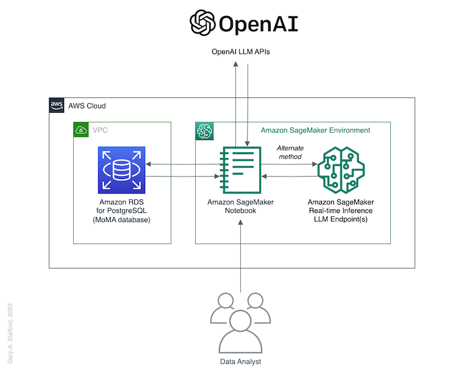

# NLQ on Amazon RDS using Amazon SageMaker, LangChain, and LLMs

Source code for the upcoming blog post, [Generative AI for Analytics: Performing Natural Language Queries on Amazon RDS using SageMaker, LangChain, and LLMs](https://garystafford.medium.com/generative-ai-for-analytics-performing-natural-language-queries-on-amazon-rds-using-amazon-f0e5c4132f6b). Learn to use LangChain's SQL Database Chain and Agent with large language models to perform natural language queries (NLQ) of Amazon RDS for PostgreSQL.



## Using dotenv

Your `.env` files should look as follows:

```ini
# API Keys
OPENAI_API_KEY=<your_value_here>

# Demo 1: Amazon RDS Connection 
RDS_ENDPOINT=<your_value_here>
RDS_PORT=<your_value_here>
RDS_USERNAME=<your_value_here>
RDS_PASSWORD=<your_value_here>
RDS_DB_NAME=<your_value_here>

# Demo 2: Amazon Redshift Connection 
REDSHIFT_HOST=<your_value_here>
REDSHIFT_PORT=<your_value_here>
REDSHIFT_USERNAME=<your_value_here>
REDSHIFT_PASSWORD=<your_value_here>
REDSHIFT_DATABASE=<your_value_here>
```

## Checking RDS Connection from SageMaker Notebook

```sh
# Get your SageMaker Notebook environment IP
dig +short txt ch whoami.cloudflare @1.0.0.1

# Curl RDS database instance to check connectivity
curl -v ******.******.us-east-1.rds.amazonaws.com:5432
```

## Notebook Formatting

`jupyter-black` was used to format notebooks.

```sh
pip install "black[jupyter]"

black *.ipynb
```

---

_The contents of this repository represent my viewpoints and not of my past or current employers, including Amazon Web Services (AWS). All third-party libraries, modules, plugins, and SDKs are the property of their respective owners._
